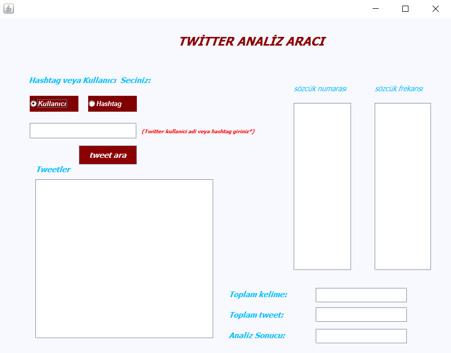

# Makine Öğrenmesi Yöntemleri Kullanarak Twitterde Veri Analizi


### Projenin Amacı

Makine Öğrenmesi Yöntemleri kullanılarak Twitterde terör olaylarını destekleyen kullanıcı ve Hashtaglerin tespit edilmesi.

### Gereksinimler ve Projenin Çalıştırılması.

* Twitter üyeliğimiz yoksa twitter e üye olup, [Twitter Apps](https://apps.twitter.com/) - üzerinden bir developer hesabı açmalıyız.Açtığımız developer hesabından bir uygulama oluşturmalıyız.
 
* Projeyi github' dan indirip eclipse ile açmalıyız.

* [Twitter Apps](https://apps.twitter.com/) - Oluşturduğumuz uygulamandan; 'Consumer Key (API Key)' , 'Consumer Secret (API Secret)' , 'Access Token'  ve  'Access Token Secret' keylerini kopyalayarak  TokenTwitterKnnVeriAnalizi.java,
 dosyasında aşagıdaki kod bloğunu bularak gerekli yerlere keyleri yapıştırınız.<br/>
		```
			ConfigurationBuilder cb = new ConfigurationBuilder(); ``` <br/>```
				cb.setDebugEnabled(true).setOAuthConsumerKey("Consumer Key (API Key)") ``` <br/> ```
						.setOAuthConsumerSecret("Consumer Secret (API Secret)") ``` <br/> ```
						.setOAuthAccessToken("Access Token")  ``` <br/> ```
						.setOAuthAccessTokenSecret("Access Token Secret"); ``` <br/> 
				


### Projenin çalıştırılmış ekran görüntüsü
		
